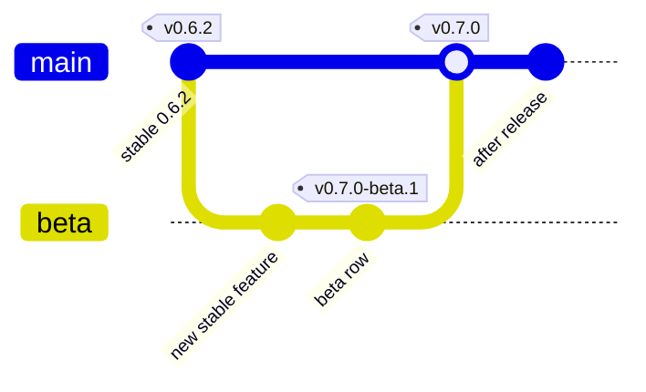

How the beta fits beside stable:

```mermaid
gitGraph
  commit id: "stable 0.6.2" tag: "v0.6.2"
  branch beta
  checkout beta
  commit id: "new stable feature"
  commit id: "beta row" tag: "v0.7.0-beta.1"
  checkout main
  merge beta tag: "v0.7.0"
  commit id: "after release"
```
